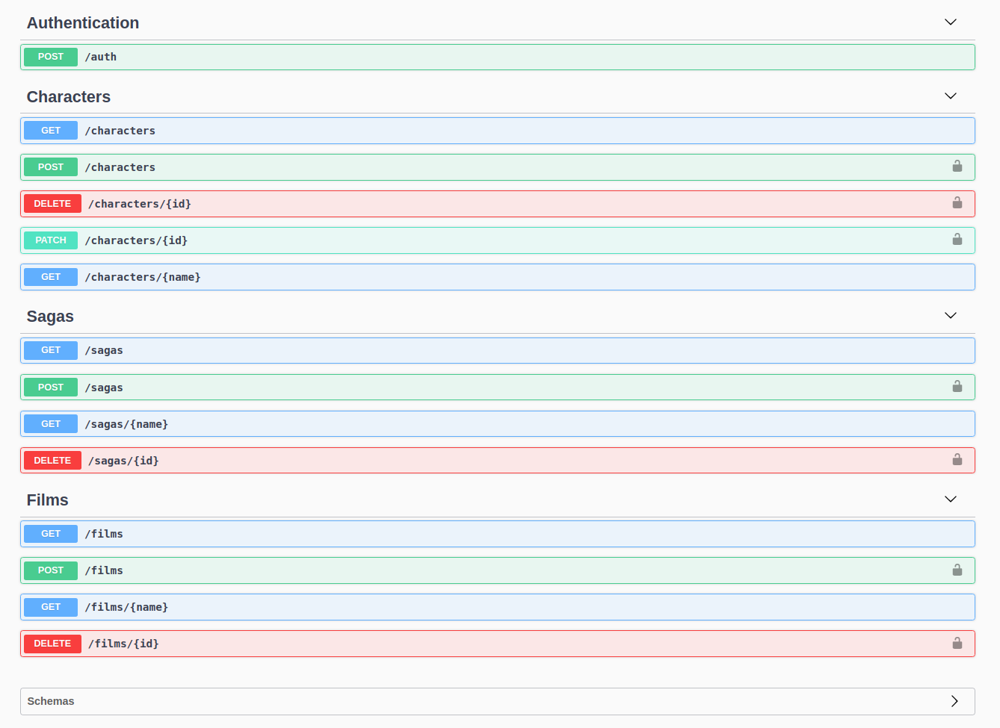

# Dragonball

<p align="center">
  
</p>

<table border="0" cellspacing="0" cellpadding="0" style="border-collapse: collapse; border: none;">
  <tr>
    <td></td>
    <td></td>
    <td></td>
    <td></td>
    <td></td>
  </tr>
</table>

This is the dragon ball rest api, an idea to provide to anyone, relevant information about the anime.
The application is compound of the following features:

<ol>
  <li>SSL support</li>
  <li>Data caching with Redis</li>
  <li>Clustering via pm2 package</li>
  <li>JWT authentication and routes protection</li>
  <li>Fancy OAPI Front-end</li>
</ol>

As a side note endpoint tests via mocha and supertest packages were added for major robustness.

This is the list of endpoints currently available:


<table>
  <thead>
    <tr>
      <th>Verb</th><th>Resource</th><th>Description</th><th>Scope</th>
    </tr>
  </thead>
  <tbody>
    <tr>
      <td>GET</td><td>/swagger</td><td>Swagger UI</td><td>Public</td>
    </tr>
    <tr>
      <td>POST</td><td>/auth</td><td>Authentication resource</td><td>Public</td>
    </tr>
    <tr>
      <td>GET</td><td>/characters</td><td>Get the list of characters</td><td>Public</td>
    </tr>
    <tr>
      <td>GET</td><td>/characters/:name</td><td>Get a single character</td><td>Public</td>
    </tr>
    <tr>
      <td>POST</td><td>/characters</td><td>Create a character</td><td>Protected</td>
    </tr>
    <tr>
      <td>DELETE</td><td>/characters/:id</td><td>Delete a character</td><td>Protected</td>
    </tr>
    <tr>
      <td>PATCH</td><td>/characters/:id</td><td>Update a character</td><td>Protected</td>
    </tr>
    <tr>
      <td>GET</td><td>/sagas</td><td>Get the list of sagas</td><td>Public</td>
    </tr>
    <tr>
      <td>GET</td><td>/sagas/:name</td><td>Get a single saga</td><td>Public</td>
    </tr>
    <tr>
      <td>POST</td><td>/sagas</td><td>Create a saga</td><td>Protected</td>
    </tr>
    <tr>
      <td>DELETE</td><td>/sagas/:id</td><td>Delete a saga</td><td>Protected</td>
    </tr>
    <tr>
      <td>GET</td><td>/films</td><td>Get a list of related films</td><td>Public</td>
    </tr>
    <tr>
      <td>GET</td><td>/films/:name</td><td>Get info about a single film</td><td>Public</td>
    </tr>
    <tr>
      <td>POST</td><td>/films</td><td>Create a film</td><td>Protected</td>
    </tr>
    <tr>
      <td>DELETE</td><td>/films/:id</td><td>Delete a film</td><td>Protected</td>
    </tr>
    <tr>
      <td>GET</td><td>/users</td><td>Get a list of users</td><td>Public</td>
    </tr>
    <tr>
      <td>GET</td><td>/users/:name</td><td>Get info about a single user</td><td>Public</td>
    </tr>
    <tr>
      <td>POST</td><td>/users</td><td>Create user</td><td>Protected</td>
    </tr>
    <tr>
      <td>DELETE</td><td>/users/:id</td><td>Delete user</td><td>Protected</td>
    </tr>
  </tbody>
</table>

There's a OAPI resource to test all the endpoints, you have to log yourself in in order to test those endpoints who are protected. This is how the swagger page looks like:

<p align="center">
  
</p>

## :rocket: How to run it ?

Before doing anything you should clone the repo:

```console
foo@bar:~$ git clone https://github.com/eiberham/dragonball.git
```

You should first install docker and docker compose by running:

```console
foo@bar:~$ sudo apt-get install docker.io docker-compose
```
Then log into your docker hub account by typing:

```console
foo@bar:~$ docker login --username YOUR_USERNAME --password YOUR_PASSWORD
```
### :warning: Important

If for any reason, you come across with the following error while trying to log in (as i did) ...

```
`Error saving credentials: error storing credentials - err: exit status 1, out: `Error calling StartServiceByName for org.freedesktop.secrets: Timeout was reached``
```

... I could solve that by installing the following packages:

 ```console
foo@bar:~$ sudo apt install gnupg2 pass
```

...Or if you face an error like this

```console
ERROR: for db Cannot start service db: driver failed programming external connectivity on endpoint
```
Just run

 ```console
foo@bar:~$ service mongodb stop
 ```

Finally run compose:

```console
foo@bar:~$ docker-compose up
```

## :anchor: Docker & DockerHub

If you wish to push the docker image to your docker hub account simply build the image and push it e.g:

```console
 foo@bar:~$ docker build -t username/dragonball:tag .
 foo@bar:~$ docker login
 foo@bar:~$ docker push username/dragonball:tag
```

To limit resource usage when running a container :

```console
foo@bar:~$ docker run -d --name dragonball \
           --publish 8080:8080
           --memory 200m \
           --memory-swap 1G \
           --cpu-shares 1024 \
           username/dragonball:tag
```

## :airplane: Deploy
In order to deploy it to the cloud, for example to an EC2 Instance over AWS:

First off you gotta make sure you downloaded the EC2 Instance's key pair to a safe place in your computer.

Then you should give it proper permissions by running:

```console
foo@bar:~$ chmod 400 dragonball.pem
```

Next step is to delete the node_modules folder directory of your project:

```console
foo@bar:~$ rm -rf node_modules
```

Next step is to copy your project files:

```console
foo@bar:~$ scp -r -i dragonball.pem ~/dragonball ec2-user@8.32.145.3:~/
```

Next step is to connect to the EC2 instance via SSH:

```console
foo@bar:~$ ssh -i dragonball.pem ec2-user@8.32.145.3
```
Then run the commands below once you're successfully connected to install docker.

```console
sudo yum update
sudo yum install docker
sudo curl -L https://github.com/docker/compose/releases/download/1.21.0/docker-compose-`uname -s`-`uname -m` | sudo tee /usr/local/bin/docker-compose > /dev/null
sudo chmod +x /usr/local/bin/docker-compose
sudo ln -s /usr/local/bin/docker-compose /usr/bin/docker-compose
```
Now start the docker service.

```console
foo@bar:~$ sudo service docker start
```

Finally run

```console
foo@bar:~$ sudo docker-compose up
```

Done!

## :ship: Kubernetes

This is a guideline for myself for running this api in a kubernetes cluster :stuck_out_tongue:

So alternatively, if you want to run it in a kubernetes cluster in your host machine do the following
(tested on mac os with docker desktop):

If you take a look at the source code you'll see that the application uses mongodb by means of persistent storage and redis as a cache or volatile storage, normally third party services like these live in their own pods, so we're going to start defining the most relevant one first and then we'll follow up with the rest.

From the docs

> minikube quickly sets up a local Kubernetes cluster on macOS, Linux, and Windows. We proudly focus on helping application developers and new Kubernetes users.

From the docs

> Helm helps you manage Kubernetes applications — Helm Charts help you define, install, and upgrade even the most complex Kubernetes application. Charts are easy to create, version, share, and publish — so start using Helm and stop the copy-and-paste.

Before anything make sure you have installed  minikube and helm in your machine and proceed to create a kubernetes cluster:

```bash
brew update
curl -LO https://storage.googleapis.com/minikube/releases/latest/minikube-darwin-amd64
sudo install minikube-darwin-amd64 /usr/local/bin/minikube
brew install helm
minikube start --vm=true
```

### Express

First off we need to conteinerize the application by building a docker image, on the root folder you'll find a dockerfile. Later on, when creating the deployment objects we will need it.

**dockerfile**

```bash
FROM node:10.16.0
WORKDIR /usr/src/app
COPY package*.json ./
RUN npm install --only=prod
COPY . .
RUN npm install -g nodemon
EXPOSE 3000
CMD npm run dev
```

In order to build the image get into the application's root directory, run this command, log into your dockerhub account and push the image

```bash
cd dragonball
docker build -t eiberham/dragonball:v1 .
docker login
docker push eiberham/dragonball:v1
```

Once completed we have to define our express deployment and service objects. For the service we have to define its type as load balancer so that it can redirect traffic to the right pod based on network load.

**express.yml**

```yaml
apiVersion: v1
kind: Service
metadata:
  name: express
spec:
  selector:
    app: express
  ports:
    - name: "3000"
      port: 3000
      targetPort: 3000
  type: LoadBalancer
---
apiVersion: apps/v1
kind: Deployment
metadata:
  name: express
spec:
  replicas: 1
  selector:
    matchLabels:
      app: express
  template:
    metadata:
      labels:
        app: express
    spec:
      containers:
        - image: eiberham/dragonball:v1
          name: dragonball
          ports:
            - containerPort: 3000
          imagePullPolicy: Always
```

Now run:

```bash
kubectl apply -f express.yml
```

Ultimately, as we have a service of **type:LoadBalancer** we'd need to expose the service by using ingress, but before let us enable the ingress add-on in minikube :

```bash
minikube addons enable ingress
```

**ingress.yml**

```yaml
apiVersion: networking.k8s.io/v1
kind: Ingress
metadata:
  name: entrance
  annotations:
    nginx.ingress.kubernetes.io/rewrite-target: /$1
spec:
  rules:
    - host: localhost
      http:
        paths:
          - path: /
            pathType: Prefix
            backend:
              service:
                name: express
                port:
                  number: 3000
```

Now run:

```bash
kubectl apply -f ingress.yml
```

### Mongo

The mongo instance will have authentication enabled so we'll need to provide username and password. Let us create the secrets.yml file that is going to hold our credentials:

**secrets.yml**

```yaml
apiVersion: v1
kind: Secret
metadata:
  name: mongo-secret
type: Opaque
stringData:
  USERNAME: eiberham
  PASSWORD: eiberham
```

Now run:
```bash
kubectl apply -f secrets.yml
``````

Since the idea is to  we create the bash script that will prepopulate the database, we're going to create a seeding bash script. For now, the most important thing to have is a user who can authenticate and issue requests to protected routes:

**seeding.sh**

```bash
mongosh "mongodb://127.0.0.1:27017/dragonball" --username $USERNAME -p $PASSWORD --authenticationDatabase dragonball <<'EOF'
db.users.insertOne({
    username : 'admin',
    password : '$2b$10$al8KvO3PCchoB/nmwU6XZ.HjpmGRSw48SS8U8P0IjRuQlfkJKISUK',
    name : 'Admin',
    profile : 2.0
})
db.characters.insertOne({
    name: 'Goku',
    description: 'Goku is the main protagonist of the dragon ball series',
    avatar:
        'https://vignette.wikia.nocookie.net/dragonball/images/5/5b/Gokusteppingoutofaspaceship.jpg/revision/latest/scale-to-width-down/224?cb=20150325220848'
})
EOF
```

In the code above we have defined an insert for the users collection using **admin** as username and password as well as an insert for the characters collection.

```bash
kubectl create configmap seeding-configmap --from-file=seeding.sh
```

In order to create the deployment/service for the mongo database we will use helm, but beforehand we have to seed the database.

**values.yml**

```yaml
mongodb:
  auth:
    usernames:
      - eiberham
    passwords:
      - eiberham
    databases:
      - dragonball
  initdbScripts:
    enabled: true
    configMapName: seeding-configmap
  extraEnvVars:
  - name: USERNAME
    valueFrom:
      secretkeyRef:
        name: mongo-secret
        key: username
  - name: PASSWORD
    valueFrom:
      secretkeyRef:
        name: mongo-secret
        key: password
```

Now it's time to install the mongo chart. If you wish to look

```bash
noglob helm install mongo oci://registry-1.docker.io/bitnamicharts/mongodb \
--set auth.usernames[0]=$(kubectl get secret mongo-secret -o jsonpath='{.data.USERNAME}' | base64 --decode) \
--set auth.passwords[0]=$(kubectl get secret mongo-secret -o jsonpath='{.data.PASSWORD}' | base64 --decode) \
--set auth.databases[0]=dragonball \
--set initdbScriptsConfigMap=seeding-configmap \
--set extraEnvVarsSecret=mongo-secret \
--values values.yml --debug
```

You can either check the pod logs to make sure there was no error or log into the pod and query any seeded collection. Plus the seeding script should be located at inside the pod.

```bash
kubectl logs <<pod>>
kubectl exec it <<pod>> /bin/bash
mongosh "mongodb://127.0.0.1:27017/dragonball" --username eiberham -p eiberham --authenticationDatabase dragonball
db.characters.find()
```

### Redis

Finally we need a redis instance, so we will install a helm chart with authentication disabled and just one replica:

```bash
noglob helm install redis oci://registry-1.docker.io/bitnamicharts/redis \
--set auth.enabled=false \
--set replica.replicaCount=1
```

By having every piece of the puzzle in place proceed to issue the following command to get the express url:

```bash
minikube service express --url
```

That should give us the express service's url and port. Now if you issue a curl to the auth endpoint it should work:

```bash
curl -X POST https://192.168.64.30:30136/api/auth -k -d '{ "user":"admin", "password":"admin" }' -H 'Content-Type: application/json'
```


## Contributing
Pull requests are welcome. For major changes, please open an issue first to discuss what you would like to change.

## :pushpin: License

This project is licensed under the MIT License - see the [LICENSE.md](LICENSE.md) file for details

<p align="right">MADE WITH ❤ BY ABRAHAM</p>
